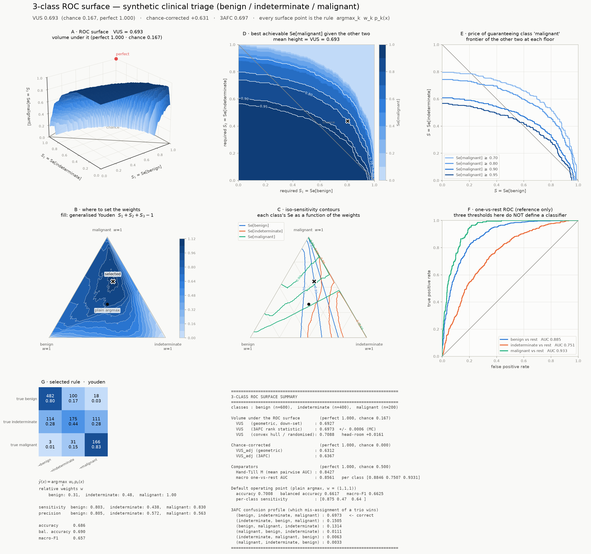
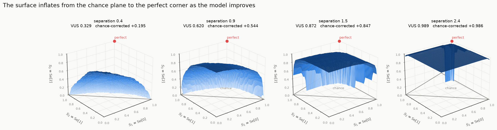
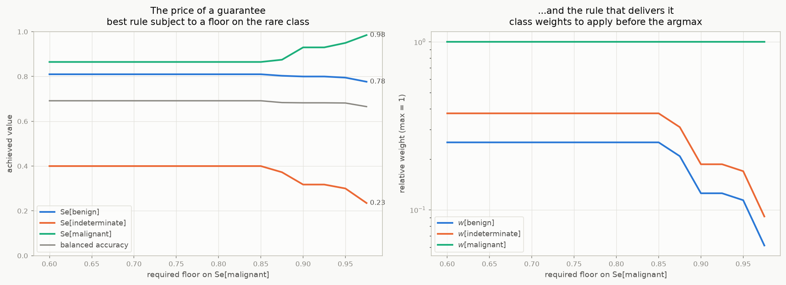
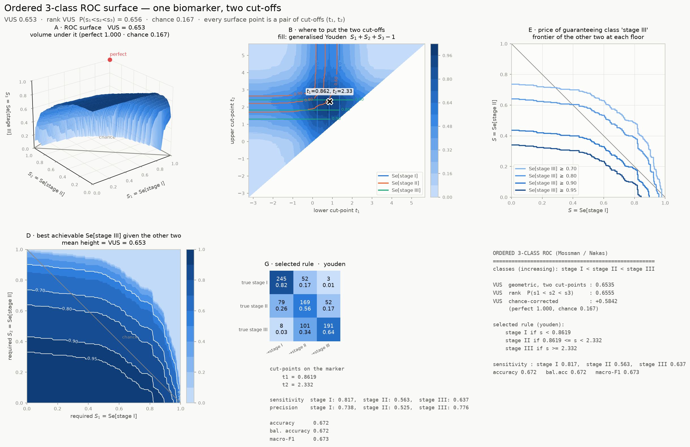
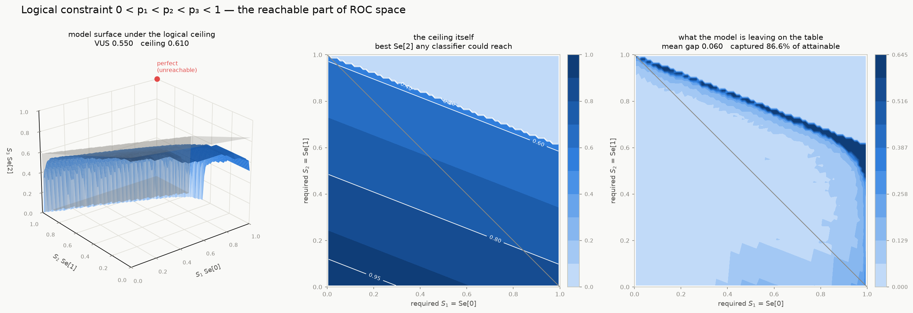

# `roc3` — a 3-dimensional ROC curve, and an AUC that means something, for 3 classes

The binary ROC curve works because three things line up: the axes are the two kinds of
correctness, the curve is the image of the *threshold sweep*, and the area under it is a
probability. `roc3` reproduces all three for three classes.

|  | binary | 3 classes (`roc3`) |
|---|---|---|
| decision rule | `ŷ = 1[p₁ > t]` | `ŷ = argmax_k wₖ·pₖ(x)`, `w` on the 2-simplex |
| free parameters | 1 | 2 |
| plot | a **curve** in 2-D: (Se₀, Se₁) | a **surface** in 3-D: (Se₁, Se₂, Se₃) |
| summary | area under it = AUC | **volume** under it = **VUS** |
| perfect / chance / worst | 1 / ½ / 0 | **1 / ⅙ / 0** |
| probabilistic reading | P(correctly ranking a ± pair) | P(correctly sorting a trio, one per class) |

For two classes the construction collapses to the ordinary ROC curve, and the volume
reproduces `sklearn.metrics.roc_auc_score` **to machine precision** (2×10⁻¹⁶ — see
`experiments/01_validation.py` §3). It is the same object, one dimension up.



> **New here? Start with [`docs/TUTORIAL.md`](docs/TUTORIAL.md).** It builds the whole
> construction from scratch on a nine-sample toy dataset you can check by hand, defines
> every symbol, and works through the pieces that are easy to state and hard to picture —
> in particular what "the probability of correctly sorting a trio" actually means, with
> the full six-way calculation written out.

---

## Install & run

```bash
python3 -m venv .venv
.venv/bin/pip install numpy scipy matplotlib scikit-learn pandas plotly

.venv/bin/python experiments/01_validation.py          # 12 sections of checks
.venv/bin/python experiments/02_demo.py                # writes figures/
.venv/bin/python experiments/03_threshold_case_study.py
.venv/bin/python experiments/04_constrained.py         # the 0<p1<p2<p3<1 propositions
.venv/bin/python experiments/05_tutorial_numbers.py    # every number in the tutorial
.venv/bin/python experiments/06_constrained_numbers.py # every number in CONSTRAINED.md
```

## Quick start

```python
from roc3 import roc_surface, dashboard

surf = roc_surface(y, proba)            # y: labels, proba: (n, 3) probabilities
surf.vus                                # 0.694   — perfect 1.000, chance 0.167
surf.vus_adjusted                       # 0.632   — chance-corrected

# pick an operating point and get a rule you can deploy
op = surf.select("balanced_accuracy", constraints={"malignant": 0.95})
print(op.describe())
#   predict argmax_k  w_k * p_k(x)   with w = benign 0.089, indeterminate 0.132, malignant 0.779
#   Se = 0.795 / 0.300 / 0.950 ; accuracy 0.656 ; the full 3x3 confusion matrix

dashboard(y, proba, criterion="youden", path="roc3.png")
```

## What the picture is

Every point of the surface is a **real, deployable classifier**: multiply each class
probability by a weight `wₖ` before taking the argmax. That is exactly what "moving the
threshold" is for two classes — for `c = 2`, `w₁p₁ > w₀p₀` is the same as `p₁ > t` with
`t = w₀/(w₀+w₁)`. Sweeping `w` over the simplex is a 2-parameter family, so it traces a
2-D surface in the 3-D cube of per-class sensitivities.

This particular family is not an arbitrary choice. It is precisely the set of Bayes-optimal
rules under the **Equal Error Utility** assumption (the cost of misclassifying a class-`k`
case depends on `k`, not on which wrong label was picked), and the literature shows the
unrestricted alternative is a 5-D object in 6-D space that is *degenerate* — the ideal
observer's decision boundaries can only meet the likelihood-ratio curve in six places, so
it has at most 4 degrees of freedom. The 2-D surface is the largest non-degenerate object
here, not a convenient simplification. See [`docs/PLAN.md`](docs/PLAN.md) §A4–A5.

Two reference objects anchor the plot: the **chance plane** `S₁+S₂+S₃ = 1` (any rule that
ignores the input lands there) and the **perfect corner** `(1,1,1)`.



## What the number is

`VUS` is the volume of the region under the surface. It has two equivalent readings:

* **Geometric** — the probability that a uniformly random requirement triple
  *"Se₁ ≥ u and Se₂ ≥ v and Se₃ ≥ z"* is achievable by **some** setting of `w`.
* **Rank / forced-choice** (Mossman 1999) — the probability that, given one case from each
  class in unknown order, the maximum-likelihood assignment recovers the correct
  permutation. This is a threshold-free U-statistic with a closed-form standard error.

Both are computed and reported; on everything tested they agree to within 0.002
([`docs/IDEAS_LOG.md`](docs/IDEAS_LOG.md) §F5).

> **Read VUS on its own scale.** Chance is **1/6 = 0.167**, not 0.5. A VUS of 0.5 is a
> respectable 3-class model. `VUS_adjusted = (VUS − 1/6)/(5/6)` puts chance at 0 and
> perfect at 1, and is printed next to the raw value everywhere.

## Using it to choose thresholds

A rotated 3-D surface is not a decision tool — you cannot read numbers off it. The
dashboard therefore pairs the surface with its **dual**, the weight simplex, and with
contour views:

| panel | question it answers |
|---|---|
| **A** 3-D surface | How good is the model, and what shape is the trade-off? |
| **B** ternary weight map | **Where do I set the weights?** |
| **C** iso-sensitivity contours | What does each class get, at any weight? |
| **D** topographic map of `Z(u,v)` | Given requirements on classes 1 and 2, what is the best class-3 sensitivity? |
| **E** iso-slices | If I must guarantee the dangerous class, what do I give up? |
| **F** one-vs-rest ROCs | (reference — three thresholds here do *not* define a classifier) |
| **G** operating-point card | What exactly do I deploy, and what will it do? |

Selection criteria: `youden` (generalised Youden index), `balanced_accuracy` (identical
argmax — both names provided), `closest_to_perfection`, `maximin` (worst-class guarantee),
`accuracy`, `max_volume`, and `expected_cost` with a full 3×3 cost matrix. Any of them can
be combined with per-class sensitivity floors:

```python
surf.select("balanced_accuracy", constraints={"malignant": 0.95})
surf.select("expected_cost", costs=[[0,1,2],[2,0,3],[20,8,0]], priors=[.7,.2,.1])
```

Sweeping a floor gives the **price of a guarantee** — on the demo problem, insisting on
`Se[malignant] ≥ z` is free up to z ≈ 0.85 and then costs the middle class dearly:



## Ordered classes

When the three classes are ordered (mild < moderate < severe) and one marker drives the
decision, the natural family is two cut-points, and the surface is parameterised by
literal cut-off values you can put straight into production:

```python
from roc3 import ordinal_roc_surface, vus_ordinal
from roc3.plots import ordinal_dashboard

osurf = ordinal_roc_surface(y, marker)      # classes in increasing order
vus_ordinal(y, marker)                      # P(s1 < s2 < s3), Nakas & Yiannoutsos
ordinal_dashboard(y, marker, path="ordinal.png")
```



## Uncertainty

```python
from roc3.inference import (vus_3afc_inference, bootstrap_vus,
                            permutation_test_vus, bootstrap_operating_point)

vus_3afc_inference(y, proba)                       # closed-form U-statistic SE + CI
bootstrap_vus(y, proba, kind="both", n_boot=200)   # stratified bootstrap
permutation_test_vus(y, proba)                     # H0: VUS = 1/6
bootstrap_operating_point(y, proba, op.weights)    # CI on (S1, S2, S3) at a fixed rule
```

## Logically constrained probabilities

If domain logic forces the class probabilities to be ordered, `0 < p₁ < p₂ < p₃ < 1`,
the analysis changes — but *which* way depends on what the constraint is about, and the
two answers are opposite:

```python
from roc3.constrained import (constrained_report, format_constrained_report,
                              gauge_normalize, vus_ceiling, to_ordered_gauge)

print(format_constrained_report(constrained_report(y, proba)))
```

* **Constraint on the model's output** (an ordered softmax, a Semantic Probabilistic
  Layer): it is a **gauge choice**. Class-wise rescaling `p_k → c_k p_k` is absorbed into
  the rule's weights, so the surface and both VUS estimators are *bit-for-bit unchanged* —
  and every model has an ordered twin. What it breaks is `argmax` (which collapses to
  "always class 3") and the readability of the weight simplex; `gauge_normalize` fixes
  both, and also changes nothing.
* **Constraint on the true posterior** (a fact about the world): it cuts ROC space with
  three planes. The perfect corner becomes **unreachable**, accuracy is capped at `π₃`
  (so the constant rule is Bayes-optimal and unbeatable), every pairwise AUC is capped at
  `1 − π_i/(2π_j)`, and the VUS is capped at a computable `VUS_max(π) < 1`. With
  priors `(0.167, 0.333, 0.5)` the ceiling is **0.444**, not 1 — barely 2.7× chance.
  So renormalise: `(VUS − 1/6)/(VUS_max − 1/6)`.

The mechanism in one line: *the constraint says you can never be more than 1/3 sure of
class 1, or more than 1/2 sure of class 2.*

Full derivations, proofs and worked numbers: [`docs/CONSTRAINED.md`](docs/CONSTRAINED.md),
written as a tutorial on one three-atom world you can check by hand.



## More than three classes

The plot stops at three — that is geometry, not a missing feature. The rank statistic
generalises:

```python
from roc3 import hum
hum(y, proba)     # chance 1/c!, perfect 1; equals the AUC at c=2 and the VUS at c=3
```

## Layout

```
roc3/
  core.py        rule family, operating points, exact 3-D hypervolume, monotone envelope
  vus.py         3AFC / HUM rank estimators, permutation profile
  ordinal.py     two-cut-point surface for ordered classes
  constrained.py ROC under the logical constraint 0 < p1 < p2 < p3 < 1
  thresholds.py  operating-point selection (7 criteria + constraints)
  metrics.py     Hand-Till M, one-vs-rest AUC, summary table
  inference.py   closed-form SE, bootstrap, permutation test
  plots.py       the dashboards (matplotlib) + interactive plotly HTML
  datasets.py    synthetic problems with known ground truth, plus the wine demo
docs/
  TUTORIAL.md    start here: the whole construction worked by hand, every symbol defined
  PLAN.md        the design: every approach considered, the maths, the chosen one
  CONSTRAINED.md the logically-constrained case, worked: gauge invariance vs. the ceiling
  IDEAS_LOG.md   every idea tried, the dead ends, the bugs, the measurements
  REFERENCES.md  annotated bibliography
experiments/     validation suite, demos, threshold case study
figures/         generated output (incl. an interactive HTML surface)
```

## Caveats, stated up front

* The surface covers the **EEU rule family**. A cost structure that distinguishes *which*
  wrong class was chosen lives outside it; the selection criterion handles such costs by
  reading the stored off-diagonals, but those extra rules are not on the surface.
* Both VUS flavours measure **ranking/separability, not calibration** — exactly like the
  binary AUC.
* The geometric VUS converges to its limit **from below** as the rule grid is refined
  (`O(1/R)`); the default `resolution=160` is about 0.005 low. Use 240–320 for reporting.
* For a **constant/heavily tied** scorer the staircase VUS gives 0 where the rank VUS gives
  1/6 — the 3-class echo of AUC's tie convention. All three flavours are always printed.

## Key sources

Scurfield (1996) · Mossman (1999) · Hand & Till (2001) · Ferri, Hernández-Orallo & Salido
(2003) · Nakas & Yiannoutsos (2004) · Landgrebe & Duin (2007, 2008) · He & Frey (2008) ·
He, Gallas & Frey (2010) · Edwards & Metz (2012) · Kleiman & Page (2019).
Full annotations in [`docs/REFERENCES.md`](docs/REFERENCES.md).
