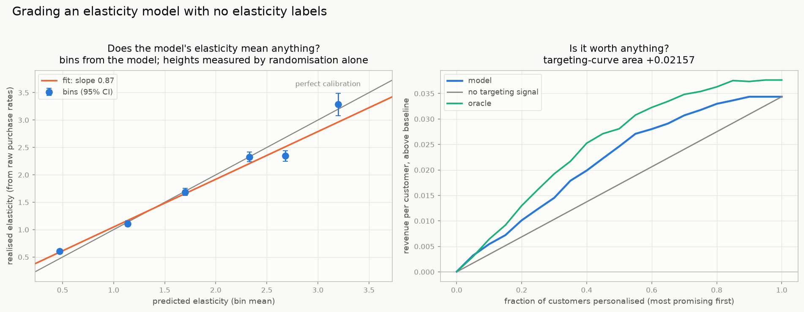

# Grading a price-elasticity model when no elasticity is ever observed

**Research note.** Code: [`roc3/elasticity.py`](../roc3/elasticity.py).
Every number here comes from

```bash
.venv/bin/python experiments/08_elasticity.py
```

Prerequisites: [`PRICETEST.md`](PRICETEST.md) for the setting.

> **New to this?** [`ELASTICITY_TUTORIAL.md`](ELASTICITY_TUTORIAL.md) builds the whole
> thing up on a 900-customer toy you can check with a calculator: what elasticity is, why
> there is no label and never will be, the two identities derived and worked by hand, and
> inverse-probability weighting from scratch. This note is the compact results version.

---

## 0. The problem, and the way out

You have a randomised price test and a model of `P(arm | x, bought)`. From it you want a
per-customer **price elasticity**, and you want to know whether that elasticity model is
any good — and which of two is better.

The obstacle you identified is real and permanent: **a customer's elasticity is a contrast
between two things that never both happen.** Each person appears at one price, and all you
see is a binary purchase. There is no label, and there never will be one. Nothing in the
data can be compared against a per-customer elasticity.

The way out is a change of level:

> Elasticity is **not identified for an individual, but it is exactly identified for any
> group.** Because the arms were randomised, any pre-specified set of customers contains
> all three arms in known proportion, so its demand curve is read straight off raw purchase
> rates. And a model's predictions *are* a way of forming groups.

That converts an impossible individual-level problem into an easy group-level one. It is
the GATES idea of Chernozhukov, Demirer, Duflo & Fernández-Val (Econometrica 2025), and it
is the backbone of everything below.

---

## 1. Two exact structural facts

Before any evaluation, two identities make this setting unusually clean. With
`p_k(x) = P(arm = k | x, bought)`, `β_k(x) = P(buy | x, arm k)`, price multipliers `m_k`
and randomisation probabilities `q_k`, Bayes gives `p_k ∝ q_k β_k`.

**(1) The arm classifier already *is* an elasticity model.** The unknown normalising
factor cancels out of any ratio, so the arc elasticity comes out exactly:

```
ε(x) = − [ log p₃(x) − log p₁(x) − log(q₃/q₁) ] / [ log m₃ − log m₁ ]
```

No extra modelling, no unidentified constant. *Verified:* max error **4.4 × 10⁻¹⁵** over
600,000 customers.

**(2) The revenue-optimal personalised price is a point on the 3-class ROC surface.**
Expected revenue from offering `m_k` is `m_k β_k(x) = c(x)·m_k p_k(x)/q_k` with `c(x) > 0`
free of `k`, so

```
argmax_k  m_k β_k(x)   =   argmax_k  (m_k/q_k) · p_k(x)
```

which is exactly `roc3`'s weighted-argmax rule with weights proportional to the prices.
**Choosing an operating point on the surface is choosing a pricing policy.** *Verified:*
100.000000% agreement with the truth on 600,000 customers.

The level of demand is *not* needed to pick the price — but it is needed to predict
revenue, and it comes free from a plain purchase-propensity model:
`β_k(x) = p_k(x)·P(buy|x)/q_k` (`demand_curve_from_posterior`, verified to 4.4 × 10⁻¹⁶).

---

## 2. Validation 1 — realised elasticity by predicted-elasticity bin

**The one plot to show a stakeholder.** Bin customers by the model's out-of-fold predicted
elasticity; inside each bin, estimate the elasticity from raw per-arm purchase rates.
Randomisation makes bin membership independent of the arm, so this rests on the
experimental design alone — no outcome model, no propensity model, no assumptions.

```python
from roc3.elasticity import elasticity_from_posterior, gates_elasticity, blp_slope
eps = elasticity_from_posterior(proba, price_multipliers=(0.9, 1.0, 1.1))
g   = gates_elasticity(arm, bought, eps, n_bins=5)   # arm/bought for ALL customers
blp_slope(g)
```

Three models on the same 600k-customer simulation — A uses the informative feature, B is a
gradient booster, C sees only an irrelevant feature:

**A: logistic regression on both features** — `corr(ε̂, ε_true) = +0.987`

| bin | n | predicted | realised | 95% CI | purchase rates by arm |
|---|---|---|---|---|---|
| 0 | 120,000 | 0.584 | 0.624 | (0.59, 0.65) | 0.880 / 0.830 / 0.775 |
| 1 | 120,000 | 1.425 | 1.310 | (1.26, 1.36) | 0.741 / 0.654 / 0.567 |
| 2 | 120,000 | 1.943 | 1.926 | (1.86, 1.99) | 0.603 / 0.503 / 0.407 |
| 3 | 120,000 | 2.460 | 2.623 | (2.53, 2.72) | 0.450 / 0.340 / 0.266 |
| 4 | 120,000 | 3.303 | 3.049 | (2.90, 3.20) | 0.233 / 0.169 / 0.126 |

monotone ✅ · spread **+2.425 ± 0.079** · calibration slope **+0.956 ± 0.017**

**C: logistic regression on the irrelevant feature** — `corr(ε̂, ε_true) = −0.002`

| bin | predicted | realised | 95% CI |
|---|---|---|---|
| 0 | 1.436 | 1.533 | (1.46, 1.60) |
| 1 | 1.473 | 1.430 | (1.36, 1.50) |
| 2 | 1.493 | 1.460 | (1.39, 1.53) |
| 3 | 1.514 | 1.484 | (1.42, 1.55) |
| 4 | 1.551 | 1.570 | (1.50, 1.64) |

monotone ❌ · spread **+0.037 ± 0.051** · slope **+0.439 ± 0.414**, p(no signal) = **0.29**

The method cleanly separates a model that knows something from one that does not, using
data that contains no elasticity labels at all. And the **oracle** — scoring by the true
elasticity — comes out at slope **0.997 ± 0.018**, p(slope = 1) = 0.88: exactly calibrated,
as it must be. That is the method validating itself.

**How to read the two numbers.**

* **Spread** (top bin minus bottom bin realised elasticity) — does the model separate
  customers at all? This is the *ranking* question.
* **Calibration slope** — regress realised on predicted across bins.
  Slope ≈ 0 → no signal. Slope > 0 but ≠ 1 → the ordering is right, the magnitudes are
  not (fixable by recalibration). Slope ≈ 1 → the numbers mean what they say.

---

## 3. Validation 2 — what the policy is actually worth

Ranking well is not the goal; making money is. Because the arms were randomised,
inverse-probability weighting gives an **unbiased** estimate of the revenue any policy
*would have* earned, with no modelling assumptions:

```
V(π) = mean_i  1{K_i = π(x_i)} / q_{K_i} · m_{K_i} · Y_i
```

```python
from roc3.elasticity import revenue_optimal_policy, policy_value
pol = revenue_optimal_policy(proba, (0.9, 1.0, 1.1))
policy_value(arm, bought, pol)                  # IPW, assumption-free
policy_value(arm, bought, pol, beta_hat=beta)   # AIPW, same guarantee, far less noise
```

*Verified:* IPW recovers the oracle policy's value, which it cannot observe —
`0.53694 ± 0.00145` against a true `0.53529`.

### The trap: benchmark against the best *flat* policy

| policy | revenue / customer | vs flat mid |
|---|---|---|
| flat 0.90 | 0.52176 | +4.49% |
| flat 1.00 | 0.49933 | — |
| flat 1.10 | 0.47258 | −5.36% |
| personalised, model **C** (no signal) | **0.52176** | **+4.49%** |
| personalised, model B | 0.53365 | +6.87% |
| personalised, model A | 0.53667 | +7.48% |
| personalised, oracle | 0.53694 | +7.53% |

**Model C has no elasticity signal whatsoever and still shows +4.49%.** Its "personalised"
policy is degenerate — with a flat posterior, `argmax_k m_k p_k(x)` is the same arm for
everyone — so it is the constant rule *"always offer the cheap price"*, and its value is
`0.52176`, equal to flat-cheap to five decimals. The gain is entirely from discovering a
better *flat* price, which is not personalisation.

Against the **best flat** policy instead, the picture is honest:

| model | vs best flat |
|---|---|
| C (no signal) | **+0.00%** |
| B | +2.28% |
| A | +2.86% |
| oracle | +2.91% |

So A captures 98% of the available personalisation value and B captures 78%. Always
benchmark against `max_k V(flat_k)`.

---

## 4. Validation 3 — the doubly-robust pseudo-outcome, and its two traps

The standard tool in the CATE literature is a doubly-robust pseudo-outcome whose
conditional mean is the effect:

```
ψ_i = β̂₁(x_i) − β̂₃(x_i) + 1{K=1}/q₁ · (Y_i − β̂₁) − 1{K=3}/q₃ · (Y_i − β̂₃)
```

It works — *verified* unbiased, mean `+0.1513` against a true mean uplift of `+0.1548`.
But here it comes with two traps, and both matter.

### Trap 1 — the target is a *difference*, elasticity is a *ratio*, and neither is the decision

`ψ` estimates the uplift `β_cheap − β_expensive`. Elasticity is a log-ratio. These pick
out **different customers**: a ratio is largest where `β` is small, a difference is largest
where `β ≈ ½` and the demand curve is steepest. In this population:

```
Spearman(true elasticity, true uplift)         +0.024      <- essentially unrelated
Spearman(true elasticity, true revenue gain)   +0.780
Spearman(true uplift,     true revenue gain)   +0.444
```

They are nearly uncorrelated. **So the elasticity model is not automatically the right
targeting score**, and neither is uplift. For a pricing decision the score to rank on is
the predicted **revenue gain** `max_k m_k β̂_k(x) − m_base β̂_base(x)`, which
`elasticity_report` computes and uses for the targeting curve. Decide what you are ranking
for before you pick a metric.

### Trap 2 — never rank-correlate against ψ

`ψ` is a near-three-point variable whose atoms depend on `x`, so its **ranks** encode
`β(x)` rather than the uplift. The result is a rank correlation that swings with the
nuisance model even though AIPW is unbiased throughout:

| `β̂` used in ψ | Pearson(ε_true, ψ) | Spearman(ε_true, ψ) |
|---|---|---|
| the truth | +0.0009 | +0.005 |
| zero (pure IPW form) | −0.0004 | −0.008 |
| from a constant `P(buy\|x)` | +0.0004 | **−0.105** |

Pearson tracks the near-zero truth in all three cases. Spearman does not, and with a poor
`β̂` it reports a confident *negative* relationship that does not exist.

The decisive case is the **oracle**. Scoring by the *true* elasticity, the main run gives
Pearson `+0.0026` and Spearman `−0.0738` — and since the oracle is the truth by
construction, that −0.074 is pure artefact. Every model in the run shows the same
artefact at the same magnitude (A −0.074, B −0.077), which would have ranked them
identically and told you nothing. **Use regression against ψ; never rank correlation.**

And note the signal-to-noise: per-customer `sd(ψ) = 1.22` against a true uplift spread of
`0.043` — **28× more noise than signal**. Nothing per-customer will be visible; only
aggregates will. Which is why §2 bins.

---

## 5. Comparing two models

Paired bootstrap — both models scored on the *same* resampled customers, so the shared
sampling noise cancels:

```python
from roc3.elasticity import compare_elasticity_models
compare_elasticity_models(arm, bought, score_a, score_b, policy_a, policy_b, n_boot=400)
```

**A vs C (real signal vs none)** — 200 replicates, 200k customers:

| criterion | A | C | difference | 95% CI | |
|---|---|---|---|---|---|
| policy value | +0.53809 | +0.52593 | **+0.01216** | (+0.0078, +0.0162) | significant |
| GATES spread | +2.277 | −0.039 | **+2.316** | (+2.015, +2.599) | significant |
| calibration slope | +0.952 | −0.520 | **+1.473** | (+0.153, +2.748) | significant |

**A vs B (two genuinely good models)**:

| criterion | A | B | difference | 95% CI | |
|---|---|---|---|---|---|
| policy value | +0.53809 | +0.53558 | +0.00251 | (−0.0011, +0.0061) | not significant |
| GATES spread | +2.277 | +2.333 | −0.056 | (−0.255, +0.085) | not significant |
| calibration slope | +0.952 | +0.921 | **+0.031** | (+0.006, +0.054) | significant |

Worth reading carefully. A and B are indistinguishable on what they are *worth* and on how
well they *rank*, and differ only in **calibration** — A's magnitudes are slightly better.
If you only need a ranking (whom to discount), they are interchangeable; if you need the
elasticity number itself (to set a price, or feed an optimiser), prefer A. Three criteria,
three different answers, and the right one depends on the use.

This is why the suite reports all of them. No single criterion for CATE model selection is
best in general (Curth & van der Schaar 2023), and losses built from a particular learner's
pseudo-outcome are biased toward that learner (congeniality bias; Mahajan et al. 2023).



---

## 6. The recipe

```python
from roc3.elasticity import elasticity_report, format_elasticity_report
rep = elasticity_report(arm, bought, proba,          # ALL customers, buyers and not
                        price_multipliers=(0.9, 1.0, 1.1),
                        n_bins=5, p_buy=p_buy_model)
print(format_elasticity_report(rep))
```

In order of how much you should trust them:

1. **Policy value against the best flat price** (`policy_value`) — decision-relevant,
   unbiased by design, and the number a business will act on.
2. **GATES calibration curve** (`gates_elasticity`, `blp_slope`) — assumption-light,
   interpretable, separates "ranks correctly" from "magnitudes correct".
3. **Targeting curve area** (`targeting_curve`) — how concentrated the gains are; matters
   when personalisation has an operational cost.
4. **The VUS from [`PRICETEST.md`](PRICETEST.md)** — a pure ranking summary, with the
   elasticity-implied ceiling for context. It is measuring the same index, since the arm
   classifier is the elasticity model (§1).
5. **DR-based losses** — standard in the literature and useful, but read the two traps in
   §4 first.

Practical requirements, all easy to get wrong:

* **Predictions must be out of fold.** Bins formed with an in-sample model are
  self-fulfilling. (This is exactly why Chernozhukov et al. use repeated data splitting.)
* **Score all customers, not just buyers.** The model is fitted on buyers, but it is a
  function of `x`, so evaluate it on everyone — the bin purchase rates need the denominator.
* **Bins need enough of each arm.** The per-bin standard error scales as `1/√(n_k D_k)`;
  five bins of 100k is comfortable, five bins of 500 is not.
* **Repeat over several splits** and report the variability; single-split GATES is noisy
  (a point made forcefully in Imai's 2025 comment on the original paper).

---

## 7. What this does not do

* **No method recovers an individual's elasticity.** Nothing here claims to. Everything is
  group-level, and the groups are the model's own predictions. A model can be perfect on
  every one of these criteria and still be wrong about any particular customer.
* **The GATES estimator is a ratio of estimated rates**, so it is slightly biased in small
  bins and its delta-method interval is asymptotic. Bootstrap it when bins are thin.
* **Everything assumes the randomisation held.** If the arm was not truly random —
  reassignment, opt-outs, an interacting campaign — IPW and GATES both break, and no
  amount of modelling fixes it.
* **Elasticity may not be stable.** These estimates are local to the ±10% range tested and
  to the period of the test. Extrapolating to a −40% discount is not supported by this data
  and no diagnostic here will warn you.
* **Revenue is not profit.** Pass `unit_margin` to optimise margin instead, and remember
  cannibalisation and cross-product effects are outside the experiment entirely.

---

## References

* Chernozhukov, V., Demirer, M., Duflo, E., Fernández-Val, I. (2025). *Fisher–Schultz
  Lecture: Generic Machine Learning Inference on Heterogeneous Treatment Effects in
  Randomized Experiments.* Econometrica. <https://arxiv.org/abs/1712.04802> — BLP, GATES
  and CLAN, with repeated data splitting. The source of the binning idea in §2. See also
  Imai's 2025 comment (Econometrica) on the inferential subtleties.
* Schuler, A., Baiocchi, M., Tibshirani, R., Shah, N. (2018). *A comparison of methods for
  model selection when estimating individual treatment effects.*
  <https://arxiv.org/abs/1804.05146> — the R-loss is the most consistently reliable
  validation-set criterion.
* Mahajan, D. et al. (2023). *Empirical analysis of model selection for heterogeneous
  causal effect estimation.* <https://arxiv.org/pdf/2211.01939> — DR-based metrics dominate
  across 78 benchmarks; also the source of the congeniality-bias warning.
* Curth, A., van der Schaar, M. (2023). *In search of insights, not magic bullets: towards
  demystification of the model selection dilemma in heterogeneous treatment effect
  estimation.* — no criterion is globally best.
* Sverdrup, E., Wu, H., Athey, S., Wager, S. (2024). *Qini curves for multi-armed treatment
  rules.* JCGS. <https://arxiv.org/abs/2306.11979> — the multi-arm generalisation of the
  targeting curve in §3, for when arms have different costs.
* Imai, K., Li, M. (2023). *Experimental evaluation of individualized treatment rules* —
  the PAPE, comparing an individualised rule against a non-individualised one treating the
  same fraction. The formal version of the "benchmark against the best flat policy" point.
* Athey, S., Imbens, G. (2016). *Recursive partitioning for heterogeneous causal effects.*
  PNAS — the transformed-outcome idea `ψ` generalises.
* Kennedy, E. (2020). *Optimal doubly robust estimation of heterogeneous causal effects.*
  <https://arxiv.org/abs/2004.14497> — the DR-learner pseudo-outcome used in §4.
