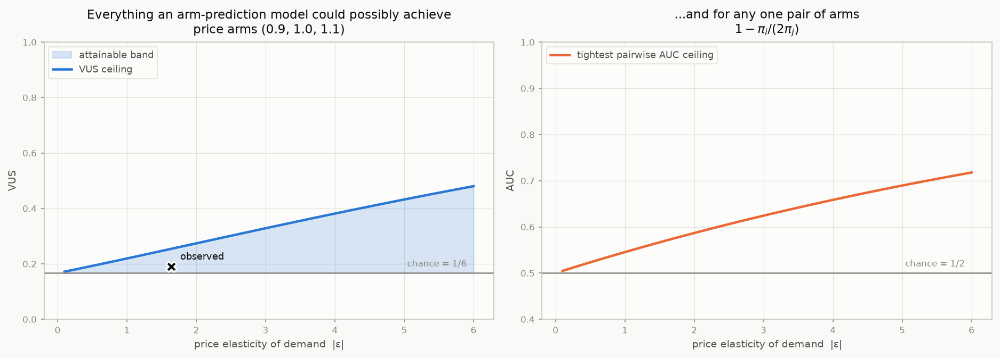

# The price-test case: "which arm was this buyer in?"

**Research note.** Code: [`roc3/pricetest.py`](../roc3/pricetest.py).
Every number here is produced by

```bash
.venv/bin/python experiments/07_pricetest.py
```

Prerequisites: [`TUTORIAL.md`](TUTORIAL.md) for the surface and VUS,
[`CONSTRAINED.md`](CONSTRAINED.md) for the ordering constraint in the abstract. This note
is the concrete case, and it changes the recommendation.

---

## 0. Summary

You run a randomised price test — arms at −10% / 0% / +10% — and want to predict, for a
**buyer**, which arm they were in. You noted that the ordering `p₋₁₀% ≥ p₀% ≥ p₊₁₀%` is a
hard logical constraint, and suspected that the right notion of VUS here differs from the
unconstrained one.

It does, and here is why:

1. **The constraint is derived, not assumed.** It follows from monotone demand plus
   conditioning on purchase. So it constrains the *true posterior*, which means it binds
   every classifier — this is "Reading A" of [`CONSTRAINED.md`](CONSTRAINED.md), the
   hard-limit case, not the harmless gauge case.
2. **The VUS ceiling is the measured demand response.** The arm prevalence among buyers is
   proportional to the per-arm purchase rate, so the ceiling is computable from the
   experiment's topline *before any model is fitted*. For a −10/0/+10 test at unit
   elasticity, **the ceiling is 0.219 against a chance level of 0.167** — the entire
   achievable band is about five points wide.
3. **Reporting VUS on the usual `[1/6, 1]` scale is actively misleading here.** In the
   simulation below the *ideal observer* — the true posterior, which nothing can beat —
   scores 0.191, i.e. `+0.030` chance-corrected. That reads as worthless. Against the
   ceiling it is **28.7% of everything attainable**, which is the honest number.
4. **The problem is one-dimensional**, so the right object is the ordinal two-cut-point
   surface, not the weight simplex: two literal cut-offs on a price-sensitivity index.
5. **The ceiling doubles as a leakage detector.** A VUS above it is impossible.
6. One thing I expected to matter and it **does not**: restricting to ordinal (interval)
   decision rules removes rules but does not lower the ceiling. §6.

---

## 1. The constraint is derived, not assumed

Notation:

| symbol | meaning |
|---|---|
| `x` | a customer's covariates |
| `k` | the arm, `1` = cheapest (−10%), `2` = 0%, `3` = most expensive (+10%) |
| `q_k` | the randomisation probability of arm `k` (known by design; usually 1/3) |
| `β_k(x)` | `P(buy | customer x, arm k)` — the customer's individual demand curve |
| `D_k` | the aggregate purchase rate observed in arm `k` — an experiment topline |
| `p_k(x)` | `P(arm = k | x, bought)` — what the model estimates |
| `π_k` | `P(arm = k | bought)` — the arm prevalence among buyers |

Condition on purchase. By Bayes,

```
p_k(x)  =  q_k β_k(x)  /  Σ_j q_j β_j(x)
```

**Monotone demand** — a given customer is at least as likely to buy at a lower price —
says `β₁(x) ≥ β₂(x) ≥ β₃(x)` for every `x`. With equal randomisation this gives, for every
buyer,

```
p₁(x)  ≥  p₂(x)  ≥  p₃(x)          (cheapest most likely)
```

which is exactly your constraint. Two things follow immediately:

* It is a **consequence** of an economic fact, not an extra modelling assumption. It
  therefore holds of the *true* posterior, not merely of whatever the model emits.
* If the randomisation is **not** equal, the constraint is on `q_k β_k(x)`, not on
  `β_k(x)`, and the ordering of `p` can break. `roc3.pricetest` takes `arm_probs` so this
  is handled rather than silently assumed.

*Note on direction.* [`CONSTRAINED.md`](CONSTRAINED.md) is written for `p₁ < p₂ < p₃`;
here it is the reverse. That is a relabelling of the classes. Everything carries over —
the ceiling is a volume, and volumes are invariant under permuting the axes — but you must
feed the machinery the arms in *ascending prevalence* order, i.e. most expensive first.
`roc3.pricetest` does that for you.

**Verified.** In the simulation of §3, the true posterior is ordered for **100.0%** of the
601,016 buyers, and the prevalences come out ordered as the constraint requires.

---

## 2. Which reading you are in

[`CONSTRAINED.md`](CONSTRAINED.md) §0 distinguishes a constraint on the *model's output*
(a gauge — changes nothing) from a constraint on the *world* (a hard cap). The derivation
above puts you squarely in the second. The diagnostic agrees: Reading A forces the
prevalences to be ordered, and here they are —
`π = (0.388, 0.333, 0.279)` for the cheap / mid / expensive arms.

So the ceiling machinery applies, and it is not academic.

---

## 3. The ceiling is the demand response

Average the Bayes display over customers:

```
π_k  =  q_k D_k / Σ_j q_j D_j          D_k = the purchase rate in arm k
```

With equal randomisation, **`π` is just the normalised per-arm purchase rate**. Those are
the first numbers any price test produces.

*Verified.* Empirical prevalence among buyers `(0.3881, 0.3332, 0.2787)` against
`D_k / Σ D_j = (0.3879, 0.3335, 0.2786)` — agreeing to `3.4e-4`.

And the VUS ceiling of [`CONSTRAINED.md`](CONSTRAINED.md) §3.7 depends on nothing but `π`.
Therefore:

> **The maximum VUS any arm-prediction model could attain is a function of the measured
> demand response, computable before a single model is fitted.**

```python
from roc3.pricetest import ceiling_from_purchase_rates
ceiling_from_purchase_rates([0.5828, 0.5011, 0.4186])   # cheapest first
#   vus_ceiling 0.2524, chance 0.1667
#   pairwise AUC ceilings  0.582 / 0.641 / 0.570
#   max accuracy 0.3879, max balanced accuracy 0.4350
```

For constant-elasticity demand `D(p) ∝ p^(−ε)` on arms `(0.9, 1.0, 1.1)`:

| \|ε\| | demand ratios (cheap/mid, mid/exp) | π ascending | VUS ceiling | band above chance |
|---|---|---|---|---|
| 0.5 | 1.054, 1.049 | (0.317, 0.333, 0.351) | **0.193** | 0.026 |
| 1.0 | 1.111, 1.100 | (0.301, 0.331, 0.368) | **0.219** | 0.053 |
| 1.5 | 1.171, 1.154 | (0.285, 0.329, 0.386) | **0.247** | 0.080 |
| 2.0 | 1.235, 1.210 | (0.270, 0.327, 0.403) | **0.274** | 0.107 |
| 3.0 | 1.372, 1.331 | (0.241, 0.320, 0.439) | **0.328** | 0.162 |
| 5.0 | 1.694, 1.611 | (0.187, 0.302, 0.511) | **0.432** | 0.266 |
| 8.0 | 2.323, 2.144 | (0.123, 0.264, 0.613) | **0.567** | 0.400 |

Chance is 0.167. At the elasticities most consumer products actually exhibit, the entire
achievable range is a few points wide.



**This is not a defect of the model, the data or the metric.** It is the statement that a
±10% price move barely changes who buys, so buyers from the three arms are nearly the same
population, so telling them apart is nearly impossible. The ceiling quantifies exactly how
nearly.

Note also what the constraint does to the familiar scalars, at the observed elasticity:

```
max accuracy           0.3879     attained by the constant rule "always the cheap arm"
max balanced accuracy  0.4350     against 0.3333 for pure guessing
max worst-class Se     0.3879
```

If someone reports accuracy on this task, they are reporting the prevalence of the cheap
arm.

---

## 4. What the ideal observer actually scores

The simulation: `s` is a customer's price-*in*sensitivity, `β_k(s) = sigmoid(s − c_k)` with
`c₁ < c₂ < c₃`, arms randomised equally, keep the buyers. 1.2M customers, 601k buyers, arc
elasticity **1.64**. Score every buyer with the **true posterior** — no model can beat this.

```
geometric VUS                     0.1913
3AFC VUS                          0.1950
chance                            0.1667
ceiling                           0.2524

on the conventional [1/6, 1] scale  +0.0296     <- reads as worthless
as a fraction of the attainable      28.7%      <- the honest number
```

A practitioner handed `+0.03` would conclude the model has failed and the features are
useless. Both conclusions would be wrong. The correct statement is that the *task* has
almost no signal in it, and this model has captured a bit under a third of what exists.

**Recommended reporting** for this problem:

```python
from roc3.pricetest import pricetest_report, format_pricetest_report
print(format_pricetest_report(
    pricetest_report(arm, proba, purchase_rates=D, marker=price_sensitivity_index)))
```

---

## 5. The problem is one-dimensional — use the ordinal mode

The arms are **ordered** (a price is a number), and under any standard demand model the
customers are ordered too. If `β_k(x)` has the monotone likelihood ratio property in a
single price-sensitivity index `s(x)` — which the logistic model above does, and which is
what "customers can be ranked by price sensitivity" means — then:

* the three buyer populations are **stochastically ordered** along `s`;
* every Bayes rule is a pair of **cut-points** on `s`;
* the weighted-argmax family and the two-cut-point family **coincide**;
* the natural VUS is the literal one, `P(s_cheap < s_mid < s_expensive)`.

That is [`roc3.ordinal`](../roc3/ordinal.py), and it is both simpler and more actionable —
it hands you two numbers to deploy instead of a weight vector on a simplex.

*Verified* on the simulation:

```
P(s_cheap < s_mid < s_expensive)   0.1951
3AFC VUS on the full posterior     0.1950     <- the same quantity
ordinal two-cut-point VUS          0.1933
geometric VUS on the posterior     0.1913
```

and the selected operating point is two literal cut-offs:

```
predict cheap arm    if s < −0.089
predict mid arm      if −0.089 ≤ s < 0.444
predict expensive    if s ≥ 0.444
```

**How to check MLRP on your data.** Fit the model, form the index
`s(x) = log(p_expensive(x) / p_cheap(x))`, and check that the three buyer groups are
stochastically ordered in it — e.g. that the empirical CDFs do not cross. If they do
cross, the problem is genuinely two-dimensional and you need the full weight-simplex
surface; if they do not, use the ordinal mode.

---

## 6. A negative result: ordinality does not tighten the ceiling

I expected this to be the main technical contribution and it turned out not to be, so it
is recorded rather than buried.

Ordinal decision regions must be **intervals** of the index (Waegeman, De Baets & Boullart:
"ordinal decision boundaries must respect the ordering of classes"; ordinal classifiers are
a strict subset of general multiclass rules). Combined with stochastic ordering, that adds
four linear constraints to the confusion polytope — the *cumulative* confusion rows must be
ordered across classes, on top of the master lemma's per-column constraints. A smaller
feasible set should mean a lower ceiling.

It does not:

| \|ε\| | general ceiling | ordinal ceiling | difference |
|---|---|---|---|
| 0.5 | 0.1927 | 0.1927 | 0.0000 |
| 1.0 | 0.2194 | 0.2194 | 0.0000 |
| 2.0 | 0.2740 | 0.2740 | 0.0000 |
| 3.0 | 0.3284 | 0.3284 | 0.0000 |
| 5.0 | 0.4322 | 0.4322 | 0.0000 |
| 8.0 | 0.5671 | 0.5671 | 0.0000 |

Why: of the polytope's 27 vertices, only 10 are ordinal-feasible, and the restriction even
removes one of the 6 vertices on the Pareto frontier of the sensitivity triple — but not
enough of the frontier to change the volume of its down-set. So **no separate ordinal
ceiling is needed**; the one from `π` alone is already correct for ordinal rules.

(I first derived these constraints with the inequality signs reversed, which produced an
"ordinal ceiling" of exactly 1/6 at every elasticity — a result too clean to be true. The
sign was settled by enumerating 1,830 interval rules in the simulation and asking which
inequalities actually held. Recorded in case the same trap catches someone else.)

---

## 7. The ceiling as a leakage detector

Because the ceiling comes from the topline alone, it is a cheap and rather powerful audit:

```python
from roc3.pricetest import audit
audit(vus=0.62, purchase_rates=[0.583, 0.501, 0.419])
#   verdict 'impossible'  (ceiling 0.252)
```

| reported VUS | verdict | fraction of attainable |
|---|---|---|
| 0.19 | plausible | 27% |
| 0.26 | **suspicious** | 109% |
| 0.62 | **impossible** | 528% |
| 0.16 | at or below chance | −8% |

A VUS above the ceiling cannot come from a correct evaluation of an honest model. In
practice the causes are, roughly in order of frequency:

1. **Target leakage** — a feature that encodes the arm: the price paid, the order total,
   the discount code, a margin field, anything computed post-treatment.
2. **Evaluating on the training split.**
3. **Scoring non-buyers as well as buyers** — the constraint and the ceiling both apply to
   the buyer-conditional problem only.
4. **Unequal randomisation** not accounted for (pass `arm_probs`).

---

## 8. The recipe

```python
from roc3.pricetest import pricetest_report, format_pricetest_report, audit
from roc3.pricetest import ceiling_from_elasticity

# BEFORE the test: is this exercise even worth doing?
ceiling_from_elasticity(1.2)["vus_ceiling"]        # 0.23 -> a very thin band

# AFTER: purchase_rates comes from the topline; arm/proba are buyers only,
# columns in price order, cheapest first.
rep = pricetest_report(arm, proba, purchase_rates=D, marker=s_index)
print(format_pricetest_report(rep))
```

Report `fraction_of_attainable`, not the raw VUS and not the chance-corrected VUS. Report
the ceiling next to it so the number is interpretable. Check the audit verdict before
believing anything.

---

## 9. What this does *not* do

* **The ceiling assumes monotone demand at the individual level.** That is an economic
  assumption. It is implied by any standard discrete-choice model, but a promotion that
  signals low quality, or a price change that shifts the customer mix through a channel,
  can break it. `check_monotone_demand` tests whether your *model* respects it; only theory
  tells you whether the *world* does.
* **The ceiling inherits the uncertainty in `π`.** It is quite sensitive to the priors, so
  put a confidence interval on it (bootstrap the arm-level purchase rates) before treating
  a near-ceiling VUS as impossible rather than merely lucky.
* **A low ceiling does not mean the experiment was a waste.** The average elasticity is
  measured precisely by the same data; it is the *heterogeneity* that is hard to detect.
  Arm prediction is a demanding way to look for it.
* **Arm prediction is a proxy for the decision you actually face**, which is *which price
  to offer to whom*. That is a policy-value problem — expected revenue under a targeting
  rule — not a discrimination problem, and VUS is at best a ranking diagnostic for it. If
  the goal is personalised pricing, the direct objective is
  `E[price × β(x, price)]` maximised over the offered price, estimated with uplift /
  CATE machinery. Say the word and I will build that instead; it is a different tool.

---

## References

* Waegeman, W., De Baets, B., Boullart, L. *ROC analysis in ordinal regression learning.*
  Pattern Recognition Letters — ordinal decision regions must be intervals; ordinal
  classifiers are a strict subset of multiclass rules.
* Kotłowski, W., Słowiński, R. *On nonparametric ordinal classification with monotonicity
  constraints.* IEEE TKDE 2013; and Gutiérrez et al., *Current prospects on ordinal and
  monotonic classification*, Progress in AI 2016 — the monotonic-classification field.
* Karlin, S. *Total Positivity* / standard MLRP results — MLRP is equivalent to strict
  monotonicity of the posterior in the index, which is what collapses this problem to one
  dimension.
* Boyd, K., Davis, J., Page, D. (2012). *Unachievable region in precision-recall space.*
  ICML — the precedent for "the problem, not the model, puts part of the evaluation space
  out of reach".
* Ding, P., VanderWeele, T. (2016). *Sensitivity analysis without assumptions* (the
  E-value) — the closest analogue in causal inference to "a bounded association ratio caps
  what you can conclude". Different quantity, same shape of argument.
* Amazon, *Science of price experimentation at Amazon* — background on randomised price
  tests in practice.
